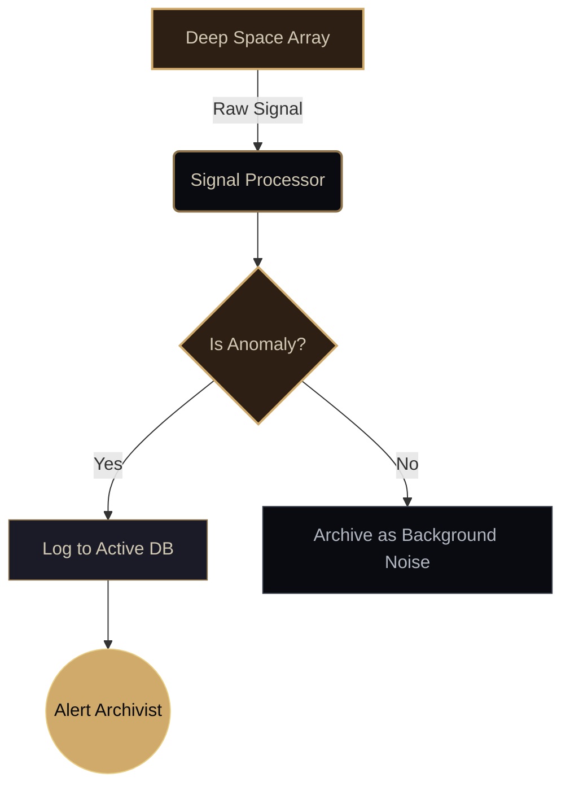
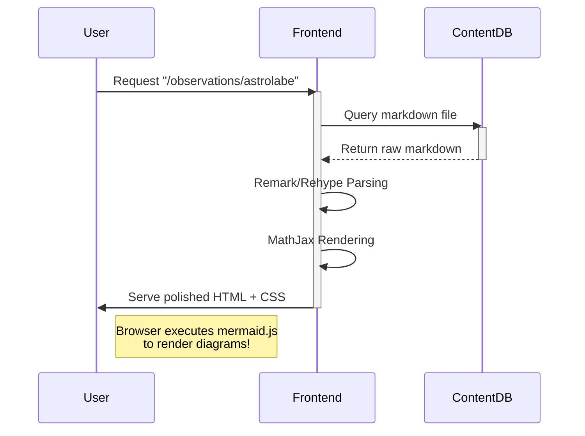

The void is vast, but our instruments are sharp. This document serves as a calibration tool for the *Wanderers' Library* database, ensuring all parsing arrays function flawlessly. 

If this document renders gracefully, the Archivists have succeeded.

---

## 1. Core Typography & Basics

This section tests the basic rendering of text, making sure the `Lora` and `Noto Serif SC` fonts cascade correctly.

这是一段用来测试 **中文混排** 与 *斜体效果* 的基础文本。当东方与西方的文字在星海中交汇，它们应当各自保持优雅。 
We also need to make sure that **bold text**, *italic text*, and ***bold italic text*** stand out from the ash-gray background against the dark night.

### 1.1 Links and Inline Code
Here is an auto-link: https://typora.io. 
Here is a labeled link pointing back to the [Homepage](/) of the Celestial Archive.

Sometimes, we need to denote technical terms like `system.config.override()` or reference files such as `celestial-archive/siteConfig.ts`. These must use the monospace fallback: `'Fira Code', 'Consolas'`.

---

## 2. Extended Syntax: The Typora Suite

We have instructed the engine to support specific extensions to aid in astronomical and historical notation.

### 2.1 Highlights
When scouring ancient texts, one often needs to ==highlight a specific passage== that seems anomalous.
### 2.2 Subscripts & Superscripts

~~hello~~

The chemical composition of the atmospheric anomaly resembles H~2~O, but the spectral reading is off by a factor of 10^3^. 
We denote the unknown variable as X^2^ + Y^2^ = Z~max~.

---

## 3. GitHub Flavored Alerts

The system must clearly communicate the severity of incoming transmissions. Here we test all five standardized alert types.

> [!NOTE]
> **Observation Log #042:** The pulsar rhythm has shifted slightly.

> [!TIP]
> **Archivist's Advice:** Always recalibrate the astrolabe before a deep-space dive.

> [!IMPORTANT]
> **Protocol Update:** Artifacts retrieved from the outer rim must be quarantined for 14 cycles.

> [!WARNING]
> **Hazard Detected:** Gamma radiation levels are spiking in sector 4. Proceed with caution.

> [!CAUTION]
> **Critical Failure imminent:** Do not look directly into the void anomaly. It looks back.

---

## 4. Advanced Mathematics (MathJax & Physics)

The engine must support complex mathematical descriptions of the cosmos, specifically the `\physics` package and line breaking `\\`.

**Inline Math:** 

- The energy of the system is given by $E = mc^2$, where $c$ is the speed of light. Let's test a physics package specific command: the trace of a matrix $\Tr(A)$.

**Block Equation:**

The Schrödinger equation governing the quantum state of the anomaly:
$$
i\hbar \frac{\partial}{\partial t} \Psi(\mathbf{r},t) = \left [ \frac{-\hbar^2}{2m}\nabla^2 + V(\mathbf{r},t)\right ] \Psi(\mathbf{r},t)
$$

**Matrix and Line Breaks:**
A tensor describing the spatial distortion, using `\\` for newlines:

```math
\begin{pmatrix}
1 & 0 & \cdots & 0 \\
0 & \cos\theta & \cdots & -\sin\theta \\
\vdots & \vdots & \ddots & \vdots \\
0 & \sin\theta & \cdots & \cos\theta
\end{pmatrix}
```

---

## 5. Structural Elements

Ensuring complex block structures render within the confined width.

### 5.1 Blockquotes

> "The stars are not just burning gas; they are memory. Every photon that hits your retina is a story that has travelled millions of years just to be witnessed."
> 
> — *Aframos Longjourney, The First Archivist*

### 5.2 Tables

A catalog of recent anomalous readings:

| Sector | Anomaly Type | Threat Level | Investigator |
| :--- | :---: | :---: | ---: |
| Alpha-7 | Temporal Rift | High | Lyra |
| Delta-9 | Echo Spasm | Low | Orion |
| Sigma-2 | Void Whispers | Constant | fuuraiko |

### 5.3 Code Blocks

A snippet of the ancient Python script used to decrypt the signal:

```python
def decode_void_signal(raw_data):
    """
    Attempts to extract meaningful patterns from the cosmic noise.
    """
    cleaned_data = []
    
    for byte in raw_data:
        if byte == 0x00:
            print("Silence detected. Continuing...")
        else:
            # Shift the bits based on interstellar interference
            cleaned_data.append(byte << 2)
            
    return bytes(cleaned_data)

# Initiate decryption
signal = receive_transmission('COM-1')
decoded = decode_void_signal(signal)
print(f"Message: {decoded}")
```

---

## 6. Diagrams & Architecture (Mermaid)

To visualize the flow of information through the Archive servers, we use client-side rendering.

**System Architecture Flowchart:**



**Sequence of a Request:**


